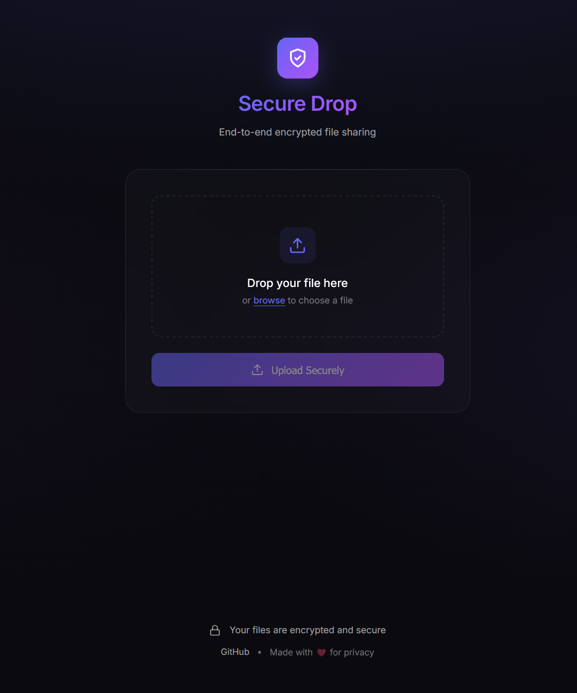

# SecureDrop

A secure zero-knowledgefile sharing app with end-to-end encryption. Files are encrypted client-side before upload — the server never sees your encryption keys.

## Stack

- **Frontend**: React, Vite, TypeScript
- **Backend**: FastAPI, AWS Lambda
- **Storage**: S3, DynamoDB
- **Infra**: Terraform

## Screenshots



## Features

- AES-256-GCM encryption in browser
- Key stored in URL fragment (never sent to server)
- Auto-expiration (1 hour to 30 days)
- Optional one-time download links
- QR code sharing

## Local Development

**Backend:**
```bash
cd secure_drop_api
pip install -r requirements.txt
uvicorn app.main:app --reload --port 8000
```

**Frontend:**
```bash
cd secure_drop_ui
npm install
npm run dev
```

## Project Structure

```
secure_drop_ui/       # React frontend
  src/
    App.tsx           # Upload component
    pages/            # Download page
    lib/crypto.ts     # Encryption logic
secure_drop_api/      # FastAPI backend
  app/
    main.py           # API endpoints
    cleanup.py        # TTL cleanup Lambda
infra/                # Terraform
```

## Deployment

```bash
cd infra
terraform init
terraform apply
```

## Environment Variables

Copy `.env.example` to `.env` in both `secure_drop_ui` and `secure_drop_api`.

## License

MIT
